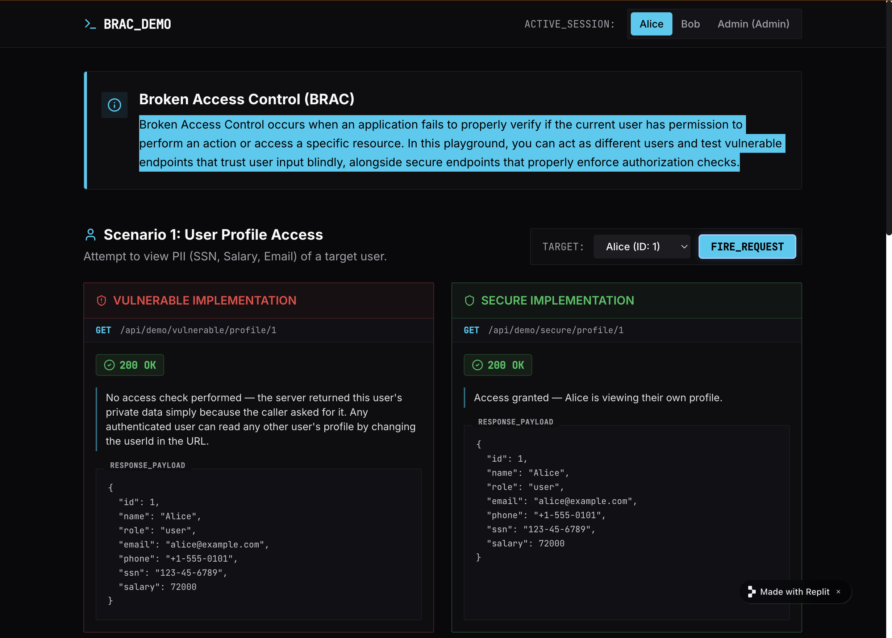
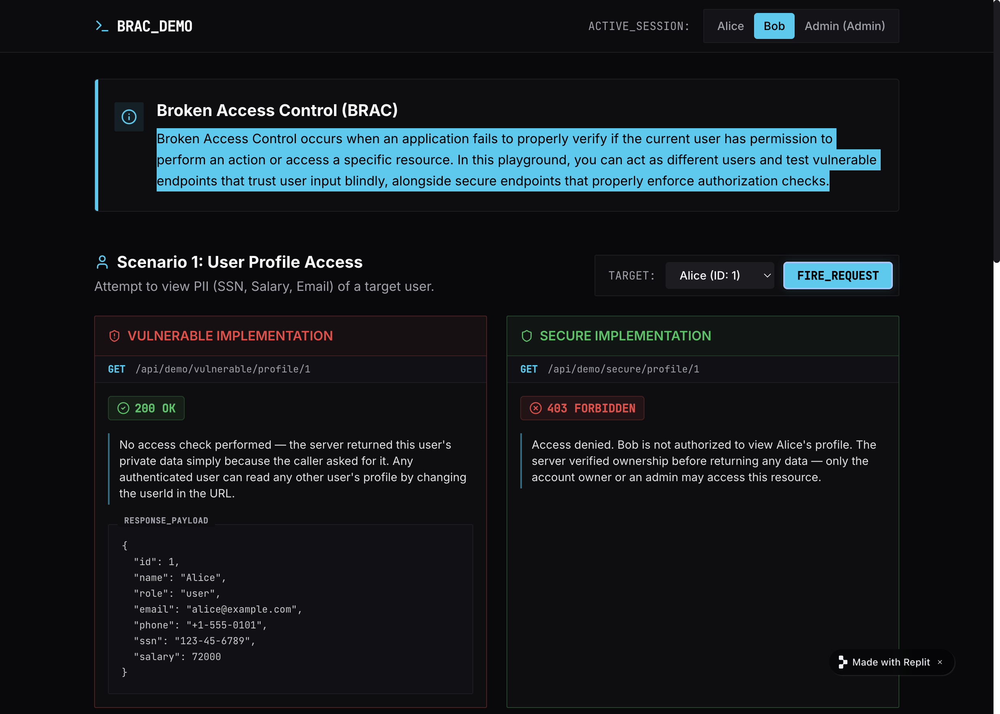

# Vibe Coding Assignment 1 — Broken Access Control (A01:2025)
 
## 1. Vibe Coding Tool: Replit

For this assignment, I used **Replit** as my vibe coding tool. I chose it because:
 
- It runs entirely in the browser with no local setup: no installs, no terminal, no environment configuration needed on my Mac.
- Its built-in AI agent generates a full working application from a plain-English prompt, letting me focus on the security concepts rather than boilerplate code.
- It instantly hosts the app at a public URL, so the demo is shareable without any separate deployment step.
 
## 2. Description of the Program

I built a **side-by-side interactive security demo** called `BRAC_DEMO`. There are three main users: Alice, Bob, and Admin. The app lets the viewer act as one of the users by clicking a session switcher in the top navigation bar.
 
The demo is organized into scenarios. For this write-up, I focus on **Scenario 1: User Profile Access**. The viewer selects a target user from a dropdown and clicks **FIRE_REQUEST** to simulate an API call.
 
- The **left panel (Vulnerable Implementation)** calls `GET /api/demo/vulnerable/profile/{id}` with no ownership check. The server returns the full profile — including SSN, salary, email, and phone number — regardless of who is asking. A `200 OK` is returned even when Bob is requesting Alice's private data.
- The **right panel (Secure Implementation)** calls `GET /api/demo/secure/profile/{id}` and enforces an ownership check on the server. If the session user does not own the requested profile and is not an admin, the server returns `403 Forbidden` with an explanation, and no data is leaked.
The contrast makes the vulnerability immediately visible: the same URL, the same request, two completely different behaviors depending on whether the server bothers to check who is asking.
 
For example, switching the active session to **Bob** and targeting **Alice (ID: 1)** shows the attack clearly. On the vulnerable side, Bob receives Alice's full profile (SSN, salary, email) with a `200 OK`. On the secure side, the same request returns `403 Forbidden` because the server detects that Bob's session does not own Alice's profile.
 
**Live demo:** https://secure-access-demo--hoangnhila.replit.app

 
## Screenshots

 
*Alice can access her information in any situation.*



*On the vulnerable side, Bob is the active session, targeting Alice (ID: 1). The vulnerable endpoint returns Alice's full profile, including SSN and salary, with a 200 OK.*
*On the secure side, the secure endpoint detects that Bob does not own Alice's profile and returns 403 Forbidden; no data is leaked.*

## 3. The Vulnerability: A01:2025 — Broken Access Control
 
### What it is
 
Broken Access Control occurs when an application fails to enforce restrictions on what authenticated (or unauthenticated) users are permitted to do. The most common subtype demonstrated here is **IDOR — Insecure Direct Object Reference**, where an object identifier (a user ID, order number, file name) is exposed in a URL, and the server does not verify that the caller is authorized to access that specific object.
 
Example attack:
 
```
# Attacker is logged in as Bob (user ID 2).
# They target Alice's account by setting user_id=1:
GET /api/profile?user_id=1
# Vulnerable server returns Alice's SSN, salary, and email — no questions asked.
```
 
Access control failures are the **#1 vulnerability** in the OWASP Top 10:2025 because they are easy to miss during development (the feature works correctly for the intended user) and trivial to exploit: no special tools required, just a browser.
 
### Why it happens
 
- Developers assume attackers won't guess or enumerate IDs.
- Authorization checks are added as an afterthought rather than designed in from the start.
- Role and ownership checks exist on the front end (a button is hidden) but not on the back end (the API still responds to direct requests).

### Real-world incident
 
**Optus Data Breach (2022):** An attacker discovered an unauthenticated API endpoint that returned customer PII — names, dates of birth, phone numbers, passport numbers — when queried with sequential customer IDs. No authentication or authorization was required. Approximately 9.8 million current and former customers were affected, making it one of the largest data breaches in Australian history.
 
## 4. Problems Encountered and Solutions
 
### Problem 1: Replit's AI built more than expected
 
Replit generated four scenarios by default. I only needed one for this assignment. Rather than stripping the others out, I left them in because they strengthen the demo, and scoped my write-up to Scenario 1 only.
 
### Problem 2: Understanding the live API responses
 
Because Replit wired up real back-end endpoints (not just simulated JavaScript), the responses came back as actual HTTP calls. This made the demo more realistic but also meant I needed to understand what the server was actually doing, not just what the UI showed. Reading through the generated route handlers helped reinforce the vulnerability concept.
 
---
 
## References

- IDOR: https://portswigger.net/web-security/access-control/idor
- OWASP Top 10:2025 — A01 Broken Access Control: https://owasp.org/Top10/A01_2021-Broken_Access_Control/
- Optus breach analysis: https://www.upguard.com/blog/how-did-the-optus-data-breach-happen
