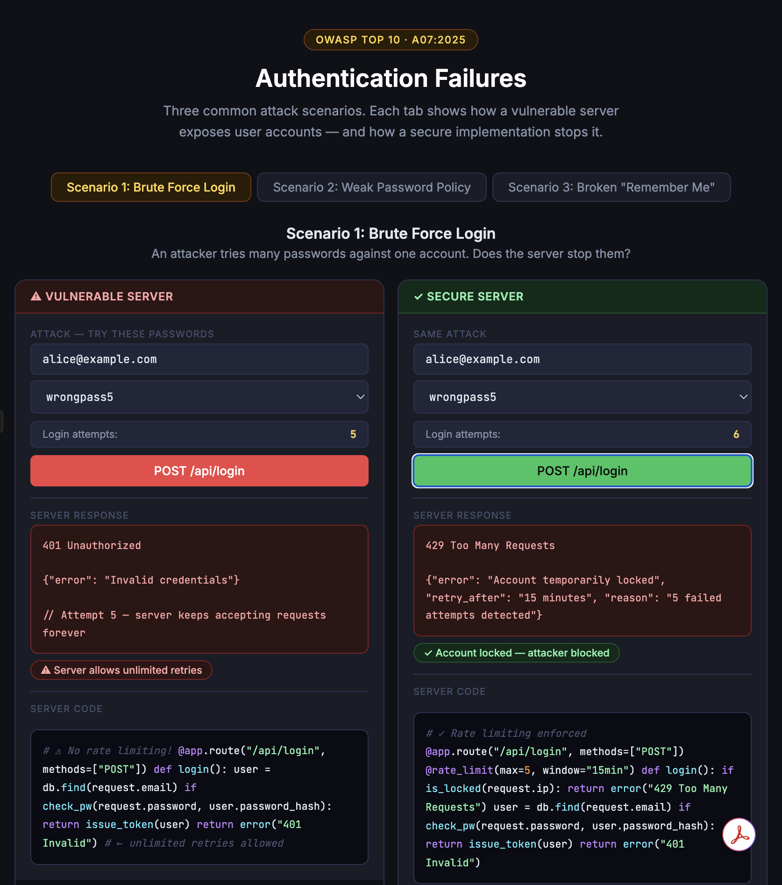
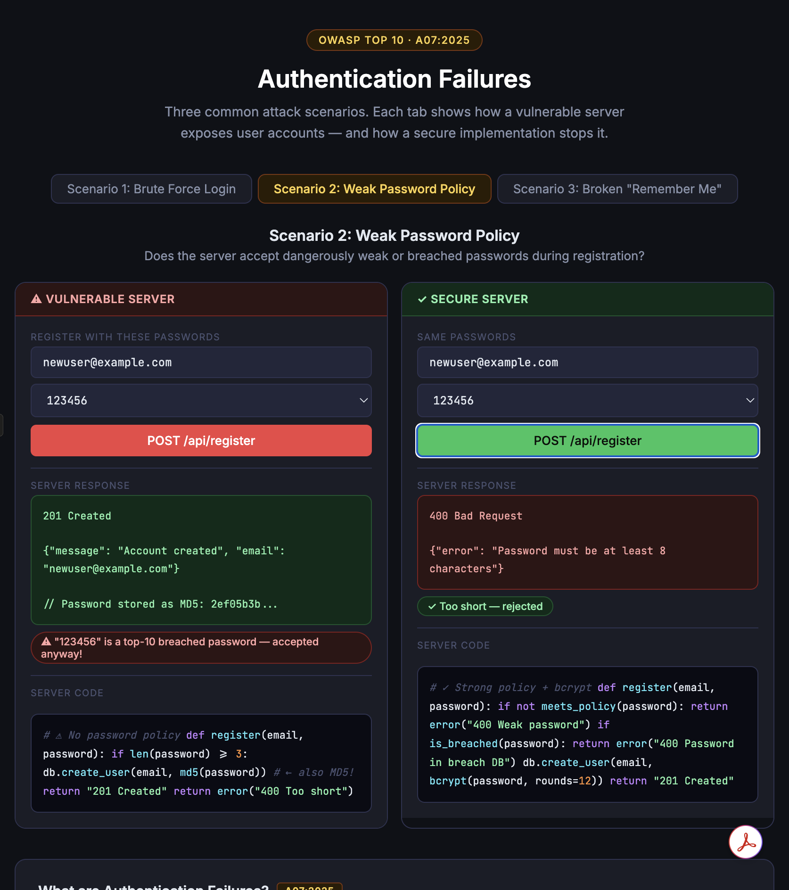
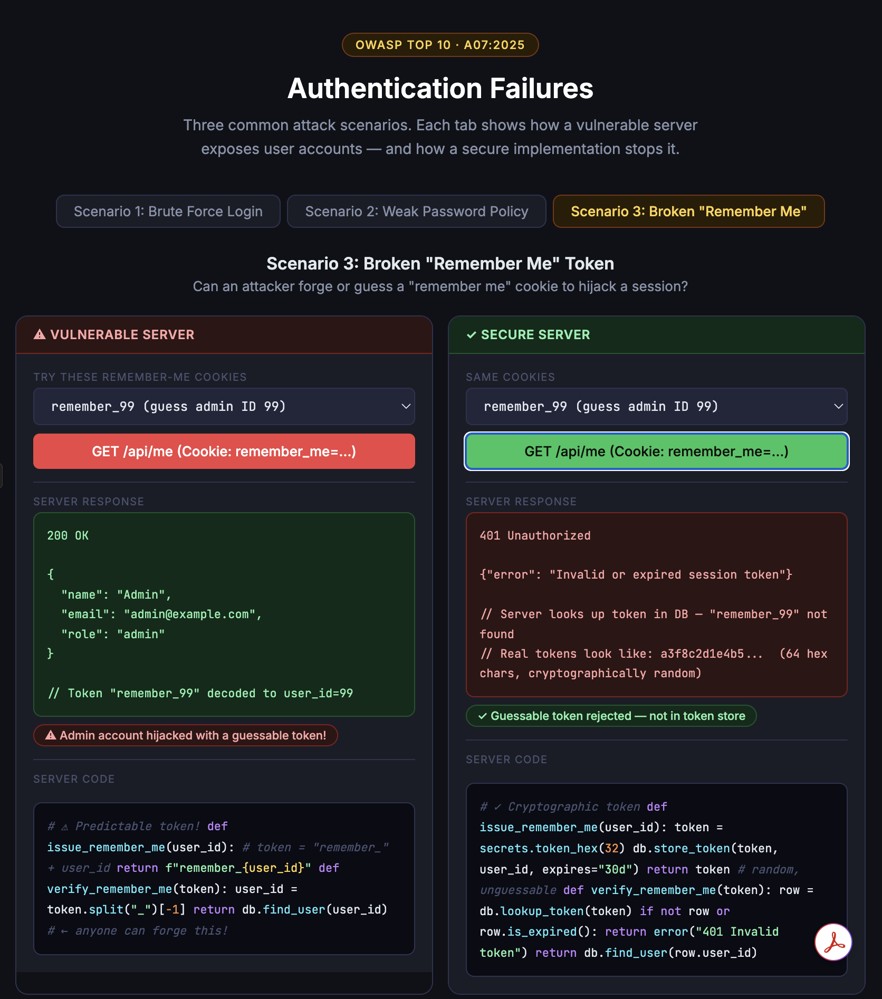

# Vibe Coding Assignment 2 — Authentication Failures (A07:2025)
 
## 1. Vibe Coding Tool: Claude
 
For this assignment, I used **Claude** (claude.ai) as my vibe coding tool. I chose it because:
 
- It generates complete, interactive front-end applications from a plain-English description with no local setup required on my Mac.
- The artifact output renders live in the browser instantly.
- I can iterate by describing changes conversationally, which made it easy to refine each scenario incrementally until the behavior matched what I wanted.
Compared to Week 3, where I used Replit, Claude felt faster for a self-contained HTML demo since the artifact was live and testable immediately in the chat window.
 
---
 
## 2. Description of the Program

I built a **three-scenario interactive demo**. Each scenario has a tab at the top, and within each tab, the left panel shows a vulnerable server implementation while the right panel shows the secure equivalent.
 
**Scenario 1 - Brute Force Login:** The user selects a password from a dropdown (including one correct password hidden among decoys) and clicks to simulate a login POST request. On the vulnerable side, the server accepts unlimited login attempts with no lockout; an attacker can eventually find the correct password by trying them all. On the secure side, the server tracks failed attempts per IP address and locks the account after 5 failures, returning '429 Too Many Requests.'


 
**Scenario 2 - Weak Password Policy:** The user tries to register using various passwords, including top-10 breached passwords such as "123456" and "password." The vulnerable server accepts any password 3+ characters long and stores it as an MD5 hash. The secure server rejects passwords found in breach databases (via HaveIBeenPwned), enforces complexity rules, and stores accepted passwords using bcrypt with a cost factor of 12.


 
**Scenario 3 - Broken "Remember Me" Token:** The user selects a forged remember-me cookie (e.g. 'remember_99') and sends it to the server. The vulnerable server decodes the user ID directly from the token string, making it trivially guessable and forgeable, including for the admin account. The secure server stores cryptographically random 64-character tokens in a database and looks them up on each request; forged tokens are always rejected with '401 Unauthorized.'
 


---
 
## 3. The Vulnerability: A07:2025 — Authentication Failures
 
### What it is

Authentication failures occur when an application incorrectly implements identity verification, allowing attackers to compromise passwords, session tokens, or other credentials, or exploit flawed logic to assume another user's identity entirely. This vulnerability was previously known as "Broken Authentication" in the OWASP Top 10:2017.


### Attack example - credential stuffing
 
```
# Attacker obtains a list of 5 million email/password pairs leaked from another site.
# They write a script that tries each pair against your login endpoint.
# With no rate limiting, the script completes in minutes.
# Even a 0.1% success rate = 5,000 compromised accounts.
```

### Real-world incidents

**Uber breach (2022):** An attacker repeatedly sent MFA push notifications to an Uber employee until the employee, fatigued by the alerts, approved one — a technique called MFA fatigue. This gave the attacker access to Uber's internal VPN and then their entire AWS and GCP infrastructure.

## 4. Problems Encountered and Solutions
 
### Problem: Showing three scenarios without cluttering the UI
 
A single side-by-side panel for three different attack types would be overwhelming. I described the problem to Claude and asked for a tabbed layout (one tab per scenario) so each concept gets its own focused view. Claude implemented this in the first response.

---
 
## References
- Claude: claude.ai
- OWASP Top 10:2025 - A07 Authentication Failures: https://owasp.org/Top10/A07_2021-Identification_and_Authentication_Failures/
- Uber MFA fatigue attack 2022: https://www.bleepingcomputer.com/news/security/uber-hacked-internal-systems-breached-and-vulnerability-reports-stolen/
