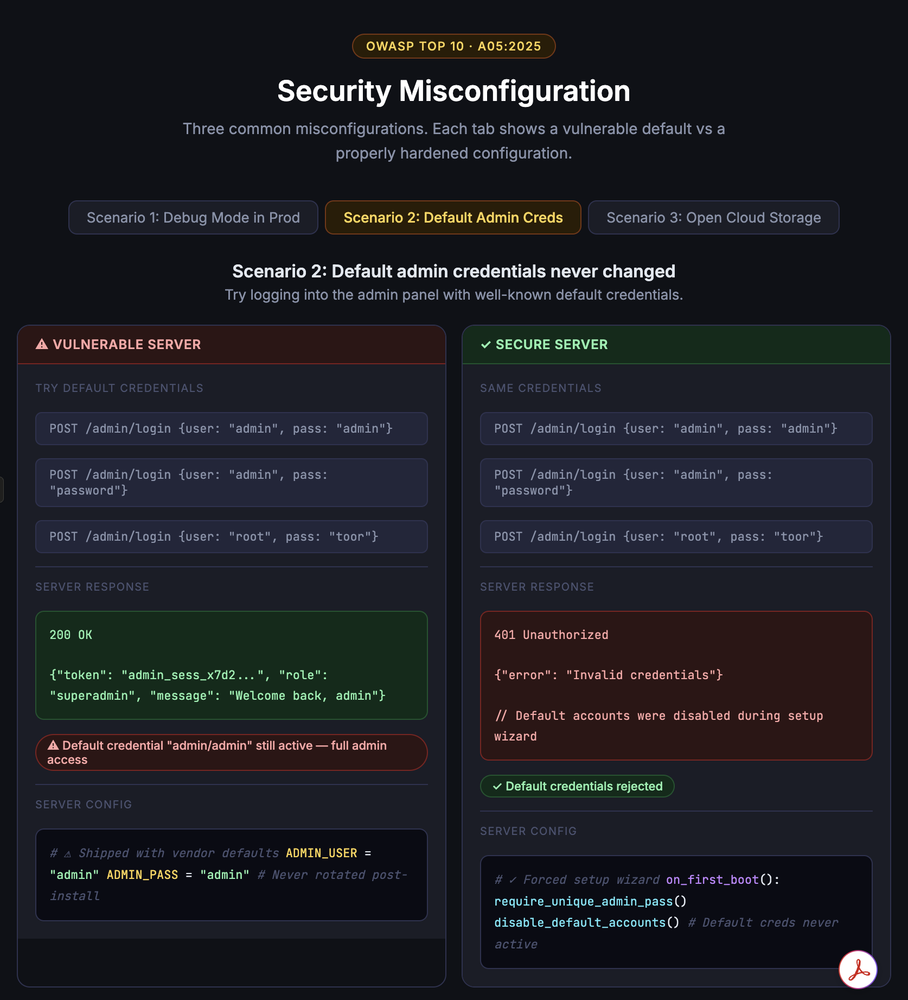

# Vibe Coding Assignment 3 — Security Misconfiguration (A05:2025)
 
## 1. Vibe Coding Tool: Claude
 
- For this assignment, I used **Claude** (claude.ai) as my vibe coding tool, the same tool I used for Week 5.
- I chose it again because it generates a complete, interactive application from a plain-English description and renders it live in the browser with no deployment step.
 
---

## 2. Description of the Program

**Default admin credentials never changed:** The user tries logging into an admin panel using well-known default credential pairs like `admin/admin` and `root/toor`. The vulnerable server still has these vendor defaults active and grants full superadmin access. The secure server disables default accounts during a forced first-boot setup wizard, so the same credentials are rejected with `401 Unauthorized`.

---
 
## 3. The Vulnerability: A05:2025 — Security Misconfiguration

### What it is
 
Security misconfiguration occurs when an application, server, framework, or cloud service is deployed with insecure default settings, incomplete hardening, unnecessary features enabled, or overly permissive access policies. Unlike injection or broken access control, this category is often less about flawed code and more about flawed deployment and operational practices. Such as default usernames and passwords left unchanged after software installation.

### Why it happens
 
- Teams move fast in development and forget to flip flags like `DEBUG` before deploying.
- Cloud storage defaults vary by provider and are easy to misconfigure, especially when access policies are copy-pasted from documentation examples that use wildcard principals.

### Attack example
 
Step 1: The attacker runs a Shodan or Censys scan for exposed admin login pages.
Step 2: The tool returns 50,000+ matches within minutes, with no exploit code required.
Step 3: The attacker filters results and tries "admin/admin" against each one at scale.
Step 4: The success rate is low per target, but the scan covers tens of thousands of targets.

### Real-world incidents
   
**Microsoft Power Apps misconfiguration (2021):** Researchers found that 38 million records across 47 organizations, including COVID-19 contact tracing data, were exposed because Power Apps portals defaulted to allowing anonymous access to underlying data tables unless administrators explicitly changed the setting. The insecure default affected government agencies, healthcare providers, and major corporations.

---
 
## 4. Problems Encountered and Solutions

I’ve become quite accustomed to using Claude, so there were no difficulties or problems at all this week.

---
 
## References

- Claude: claude.ai
- OWASP Top 10:2025 — A05 Security Misconfiguration: https://owasp.org/Top10/A05_2021-Security_Misconfiguration/
- Microsoft Power Apps misconfiguration: https://zenity.io/blog/research/the-microsoft-power-apps-portal-data-leak-revisited-are-you-safe-now
