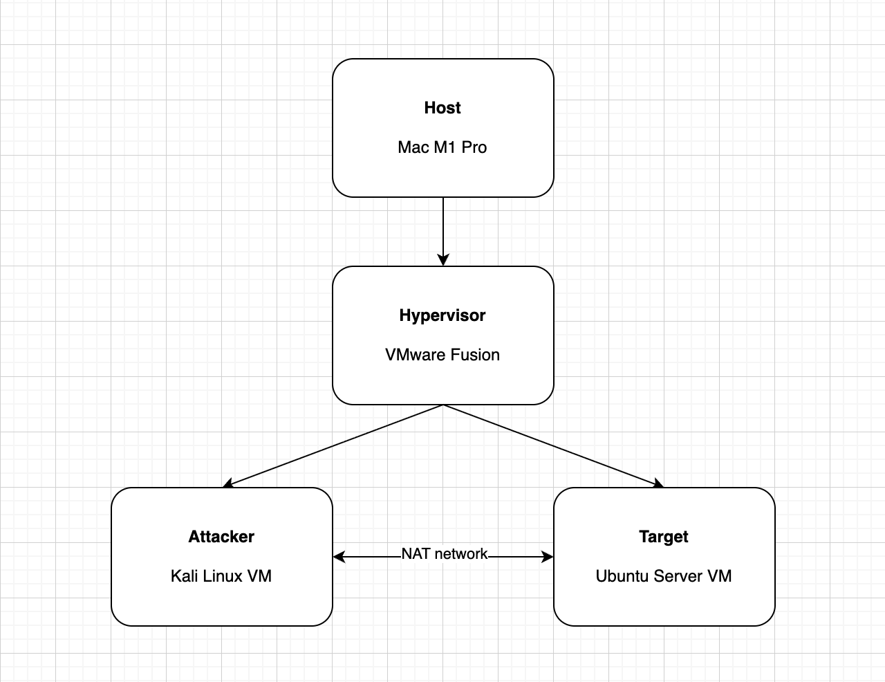

# Project 1 - Penetration Testing Lab Setup

## 1. Technology Stack Overview

This lab was set up on a MacBook Pro with an Apple M1 Pro chip using VMware Fusion Pro as the Type 2 hypervisor, with Kali Linux ARM64 as the attacker machine and Ubuntu Server 26.04 LTS ARM64 as the target machine, since Metasploitable 2 is x86-based and incompatible with Apple Silicon.

## 2. Architectural Diagram
The diagram below shows the lab environment with the Mac M1 Pro as the host, VMware Fusion as the hypervisor, and two VMs connected via NAT network.

## 3. VMware Fusion Running
Below is a screenshot of VMware Fusion running the virtual machine on the Mac M1 Pro host.

## 4. Kali Linux Running
Below is a screenshot of the Kali Linux VM running and logged in as the attacker machine.

## 5. Nessus Installed
Below is a screenshot of Nessus Essentials successfully installed and running on the Kali Linux VM via Docker.

## 6. Target Machine Running
Below is a screenshot of the Ubuntu Server 26.04 LTS ARM64 VM running as the target machine.

## 7. Ping Test
Below is a screenshot showing a successful ping from the Kali Linux VM to the Ubuntu Server target machine at 172.16.203.130 with 0% packet loss.

## 8. Problems Encountered
- **Problem 1:** VirtualBox is not working on Apple Silicon M1 → **Solution:** Used VMware Fusion Pro instead.
- **Problem 2:** Metasploitable 2 is x86-only and cannot run on M1 ARM architecture → **Solution:** Used Ubuntu Server 26.04 LTS ARM64 as the target machine instead.
- **Problem 3:** Nessus does not offer a native ARM64 package → **Solution:** Installed Nessus via Docker on Kali Linux.
- **Problem 4:** Initial Kali VM disk was set to 20GB, which ran out of space during Nessus installation → **Solution:** Deleted the VM and recreated it with a 40GB disk space.
