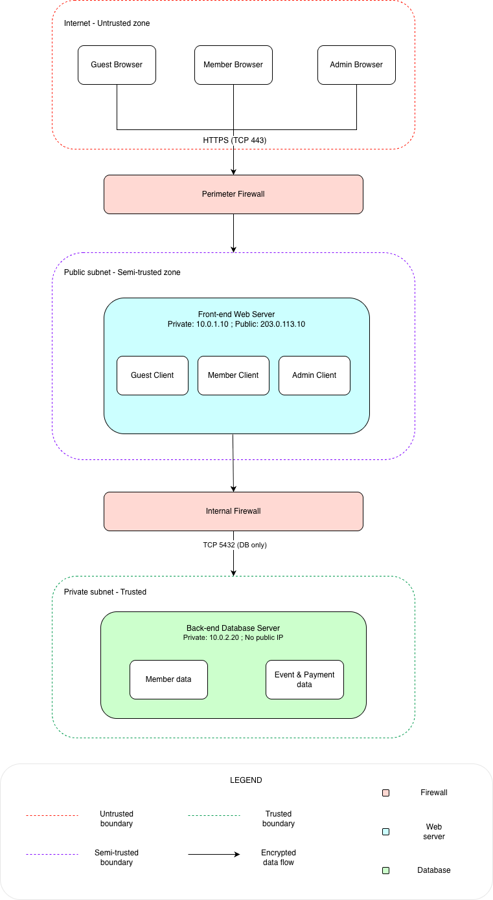

# Project 2: Secure Design Document & Threat Model Assessment
## Georgia Hiking Club (GHC) Web Application
 
---
 
## Part 1: Secure Design Document
 
### 1.1 Project Description
The Georgia Hiking Club (GHC) is a volunteer, nonprofit organization based in Atlanta, Georgia, that organizes guided hiking trips for members with varying fitness levels, both locally and internationally. The club's entire operation (membership management, event registration, trip leader coordination, and payment collection) is conducted through a single web application. The application supports three distinct user roles (Guest, Member, and Administrator/Trip Leader), each with different levels of access to data and functionality. The application also handles a payment portal for membership dues and paid excursions, adding financial data to its sensitive information profile.

### 1.2 Organization Description
The Georgia Hiking Club is a registered non-profit with no physical office and no paid staff. The organization is governed by volunteers, including a Chief Technology Officer (CTO) who is responsible for maintaining the web server and web application. Funding comes from annual member dues and business sponsorships. Because the club operates entirely online and handles both personal health information (medical conditions, fitness notes) and financial transactions (membership fees, trip payments), it faces security obligations comparable to a small business handling sensitive personal data. 

### 1.3 Deployment Environment
The GHC web application will be deployed on a cloud-hosted infrastructure using a major cloud provider (e.g., AWS or Azure). Since this is a voluntary organization, it lacks a physical office and operates with a limited IT staff. Therefore, this choice eliminates the burden of hardware maintenance while simultaneously providing built-in tools for network segmentation, access control, and system monitoring.

The deployment will consist of at minimum two network tiers:
- A Front End Web Server, accessible from the internet.
- A Backend Database Server, accessible only from the Front End Web Server and never directly from the internet.

A cloud-managed firewall (security group/network access control list) will enforce traffic rules between these two tiers. All traffic from the public internet to the web server will be encrypted via TLS (HTTPS). Backups and audit logs will be stored in isolated cloud storage separate from the production environment.

### 1.4 Secure Concepts Applicable to the Application
**Authentication & Password Policy:** The project description explicitly notes that the site was previously compromised via a brute-force attack due to weak password enforcement. Strong password policies, multi-factor authentication, account lockout mechanisms, and rate-limiting of login attempts are necessary controls.

**Authorization & Role-Based Access Control (RBAC):** The application has three meaningfully different permission levels: Guest, Member, and Administrator (Trip Leader/System Admin). Strict enforcement of these boundaries is critical. For example, a regular member must never be able to view another member's medical records or access the treasury portal.

**Sensitive Personal Data (PII & Medical Information):** Member profiles contain medical conditions and performance notes that are confidential. These fields require encryption at rest, strict access controls limiting visibility to Trip Leaders and System Admins.

**Financial Data & Payment Portal:** The payment portal collects membership dues and excursion fees. This introduces PCI-DSS-adjacent concerns: financial data must be encrypted in transit and at rest, and access to the treasury portal must be tightly restricted to System Admins only.

---
 
## Part 2: Hiking Club Threat Model Assessment
 
---
 
### Deliverable 2A: Architecture Diagram

**IP Address Summary:**
 
| Component            | Public IP      | Private IP   |
|----------------------|----------------|--------------|
| Front End Web Server | 203.0.113.10   | 10.0.1.10    |
| Backend DB Server    | none           | 10.0.2.20    |
| Guest Browser        | varies         | N/A          |
| Member Browser       | varies         | N/A          |
| Admin Browser        | varies         | N/A          |

---
 
### Deliverable 2B: STRIDE Threat Model
 
#### 1. Spoofing - Impersonation of Legitimate Users

The GHC application was previously compromised via a brute-force attack on login credentials, confirming that spoofing is a real and demonstrated threat. The application currently lacks enforced password complexity, multi-factor authentication, and account lockout. Mitigation requires enforcing strong passwords, implementing MFA (especially for admin roles), adding login rate limiting and account lockout after repeated failures, and logging all authentication events for review.

#### 2. Tampering - Unauthorized Modification of Data

The application description explicitly anticipates database tampering as a risk. Tampered data in this application could take many forms: a malicious actor might modify a member's event completion record to erase a pattern of no-shows, alter a medical record to hide a condition from trip leaders, manipulate payment records to avoid dues, or tamper with waiting list positions to gain access to a popular trip. Mitigations include prepared statements/parameterized queries to prevent SQL injection, and file integrity monitoring on the web server.

#### 3. Information Disclosure - Exposure of Confidential Data
 
The GHC application stores several categories of sensitive information, like member medical conditions, trip leader physical and medical records, performance notes written by trip leaders about specific members, and financial data including payment history. Information disclosure threats arise in multiple ways. Mitigations include server-side authorization checks on every sensitive data request (never trust the client), encryption of data at rest (especially the medical and financial fields), and restricted access to backup files.

#### 4. Elevation of Privilege — Gaining Unauthorized Access Levels
 
The three-tier privilege model (Guest → Member → Trip Leader / Admin) is only as strong as the enforcement of its boundaries. Elevation of privilege attacks seek to gain access to functionality beyond what is authorized. For example:

- A Guest could attempt to directly access member-only URLs without being logged in. 
- A Member could attempt to access trip leader functions by crafting direct API calls that bypass the UI. 
- A Trip Leader could attempt to access System Admin functions, such as the treasury portal or account management. 

Mitigations include enforcing role-based access control at the server for every protected endpoint (never relying on UI hiding alone), rejecting any client-side privilege claims, conducting regular penetration tests of the role boundary enforcement, and applying the principle of least privilege so that each role has access only to what is strictly required.

#### 5. Denial of Service - Disruption of Application Availability
 
Because the GHC web application is described as "the core of the business" without which "the club could not exist," availability is a significant security concern. Denial of Service (DoS) threats could prevent members from registering for events during a high-demand registration window, block payment processing before a trip deadline, or prevent the CTO from managing the system during an incident. Mitigations include deploying a Web Application Firewall (WAF) with rate-limiting rules, placing the application behind a cloud-based DDoS protection service, and defining and testing an incident response and recovery plan.

---
 
### Deliverable 2C: OWASP Threat Model

#### 1. Assessment Scope — What's on the Line?
 
The scope of this threat model is the entire GHC web application. The assets at risk include:
 
- Member PII and medical data.
- Trip leader credentials and certifications.
- Financial data.
- Application availability.
- Authentication infrastructure.
- Data integrity of event records.

#### 2. Vulnerabilities — What Are They?
 
- A01: Broken Access Control (OWASP Top 10 #1)
- A02: Cryptographic Failures (OWASP Top 10 #2)
- A03: Injection (OWASP Top 10 #3)
- A07: Identification and Authentication Failures (OWASP Top 10 #7)
- A09: Security Logging and Monitoring Failures (OWASP Top 10 #9)
- A05: Security Misconfiguration (OWASP Top 10 #5)
- A04: Insecure Design (OWASP Top 10 #4)

#### 3. Countermeasures — What Can You Do About It?

- Authentication hardening: Enforce password complexity requirements (minimum length, character classes). Implement account lockout after 5–10 failed login attempts per account. 
- Data protection: Encrypt sensitive database fields (medical conditions, payment records). Ensure backups are encrypted and access-controlled.
- Logging and monitoring: Implement server-side audit logging for all authentication events, role-sensitive data access, and all create/update/delete operations on member and event records. 
- Payment portal: Do not store full payment card data. Restrict treasury portal access to the System Admin role only and log all access.

#### 4. Prioritized Risks — Listed in Order

| Priority | Risk | 
|----------|------|
| **1** | Brute-force / credential stuffing attack on login | 
| **2** | Unauthorized access to confidential member medical data | 
| **3** | Elevation of privilege (Member → Admin functions) | 
| **4** | Financial data exposure or manipulation in payment portal | 
| **5** | Lack of audit logging enabling undetected tampering | 
| **6** | Security misconfiguration (exposed DB port, default credentials) | 
