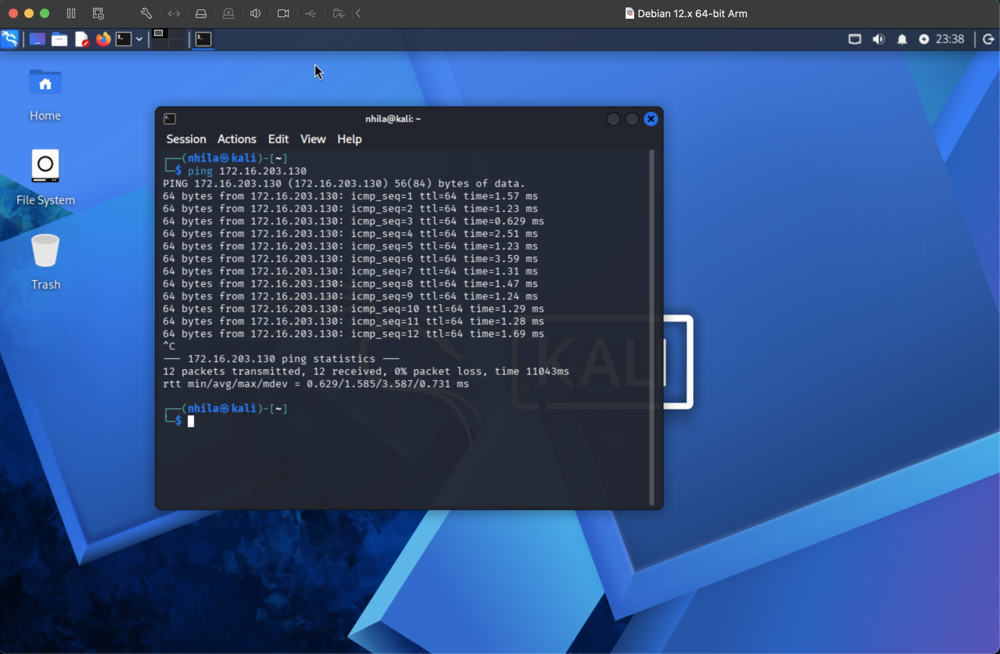
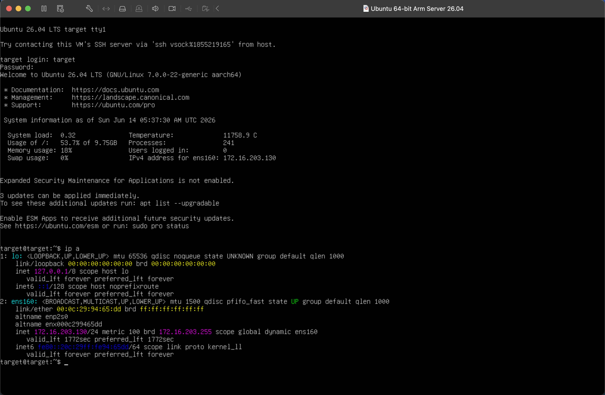
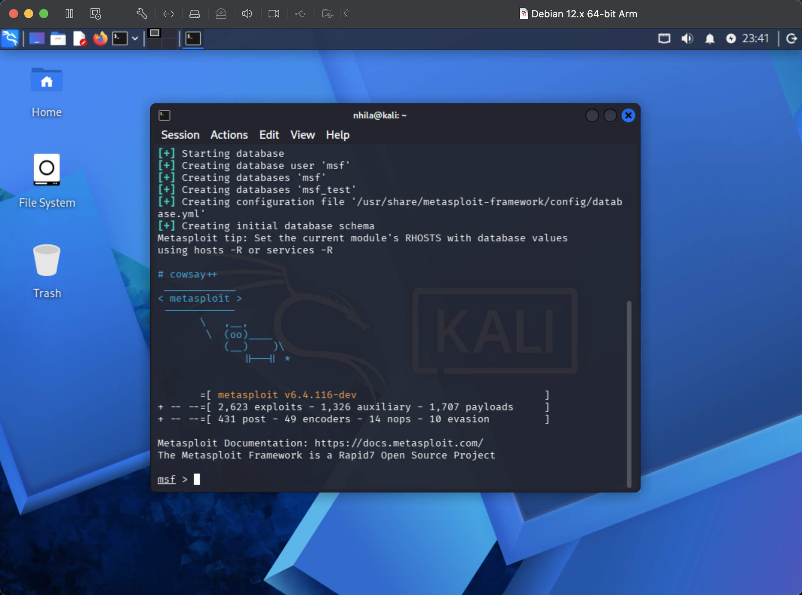
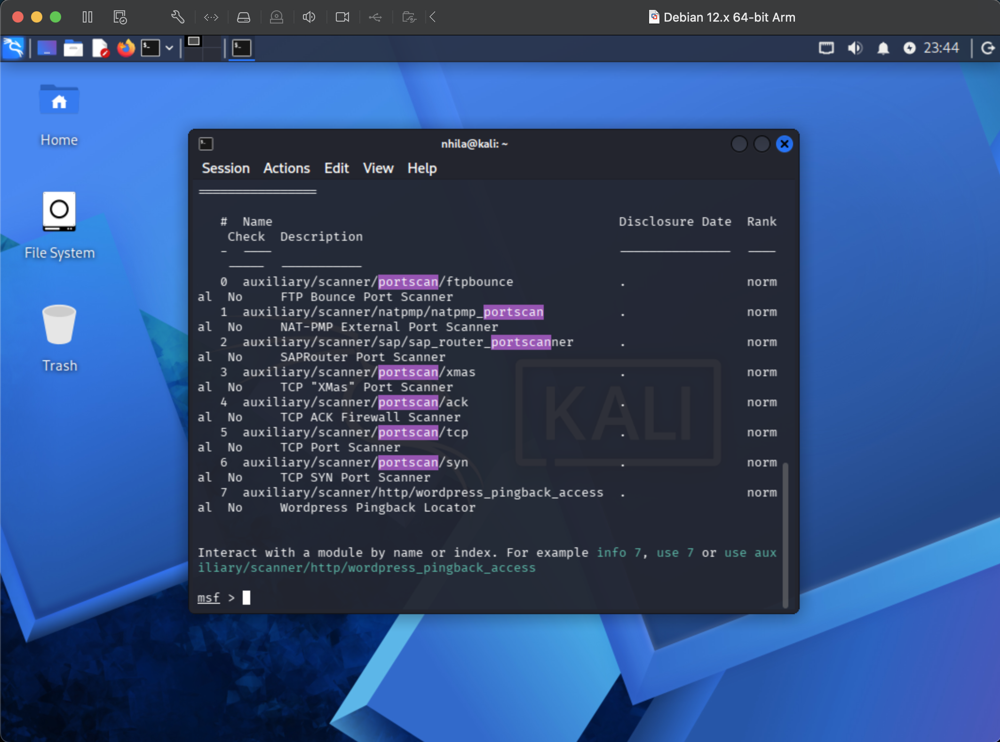
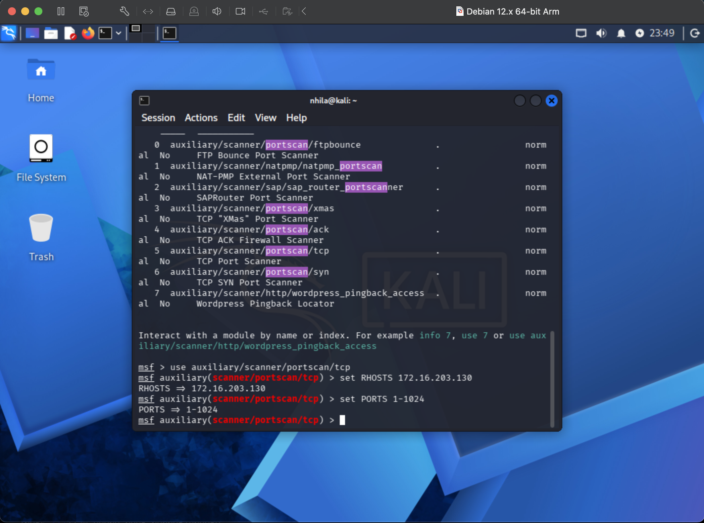
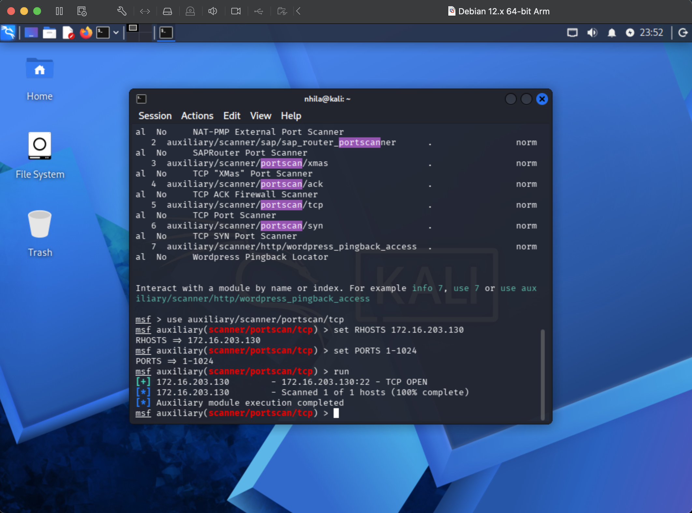
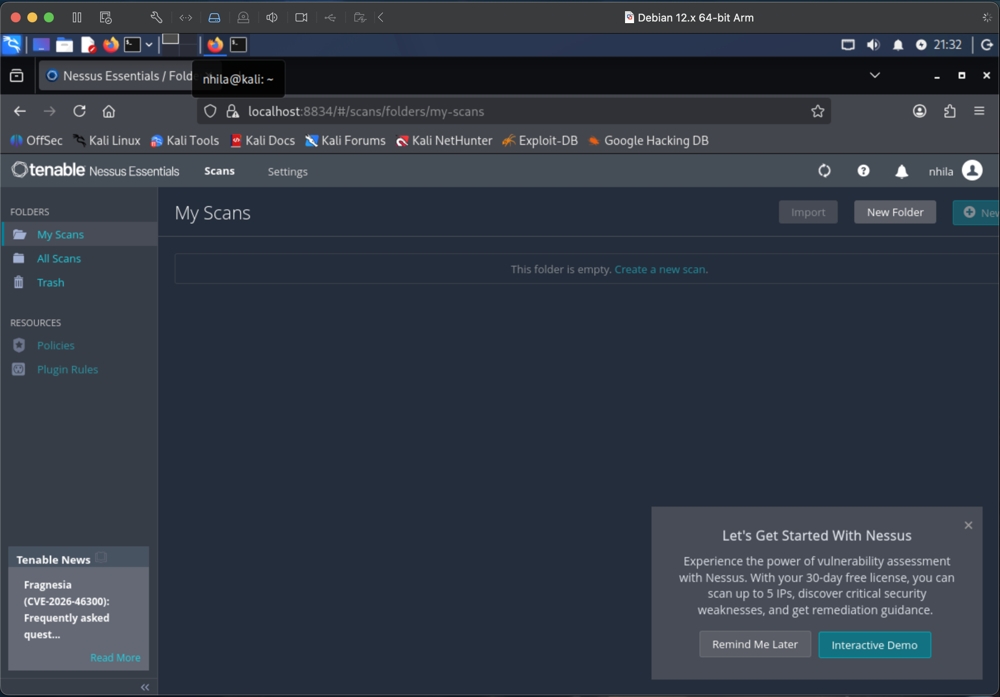

# Project 3 - Penetration Testing with Kali Linux and Metasploit

## Part 1 & 2: Metasploit Port Scan

### Screenshot 1: Both VMs Running and Connected
Both the Kali Linux VM (attacker) and Ubuntu Server VM (target) were started, and connectivity was verified with a successful ping from Kali to the Ubuntu Server target at 172.16.203.130.

### Screenshot 2: Metasploit Framework Running
Metasploit Framework was launched on Kali Linux using `sudo msfdb init && msfconsole`, and it successfully loaded to the `msf >` prompt.

### Screenshot 3: Port Scanner Search Results
Using the `search portscan` command, the available port scanning modules within Metasploit were displayed.

### Screenshot 4: Scanner Options Configured
The TCP port scanner module (`auxiliary/scanner/portscan/tcp`) was selected, with `RHOSTS` set to the Ubuntu Server target (172.16.203.130) and `PORTS` set to the range 1-1024, confirmed using `show options`.

### Screenshot 5: Port Scan Results
Running the scan with the `run` command identified port 22 (SSH) as open on the target machine, confirming the scanner successfully communicated with and probed the Ubuntu Server VM.

---

## Questions

**a. What is the purpose of port scanning from the perspective of a Black Hat hacker?**

From a Black Hat hacker's perspective, port scanning is used to identify open ports and the services running on them, revealing potential entry points and vulnerabilities that can be exploited to gain unauthorized access to a system.

**b. What is the purpose of port scanning from the perspective of an Ethical (White Hat) Hacker?**

From an Ethical Hacker's perspective, port scanning is used to identify open ports and running services. However, the goal is to proactively discover vulnerabilities and misconfigurations so they can be reported and remediated before a malicious actor can exploit them.

**c. Why did we restrict the scanned ports to 1 through 1024?**

Ports 1 through 1024 are known as the "well-known ports" and are reserved for common, standard services (e.g., port 22 for SSH, port 80 for HTTP, port 443 for HTTPS). Restricting the scan to this range allows for a quicker scan that still identifies the most commonly used and potentially vulnerable services running on a target system.

---

## Part 3: Tool Research - Nessus

### Introduction
Nessus is a vulnerability scanning tool created by Renaud Deraison in 1998 as a free, open-source remote security scanner. It is now developed and maintained by Tenable, Inc., and can be downloaded from [tenable.com/products/nessus](https://www.tenable.com/products/nessus). Nessus scans devices, applications, operating systems, and other network resources to detect security vulnerabilities and misconfigurations that could be exploited by attackers.

### Big Picture
Nessus fits into the **Scanning/Vulnerability Assessment** phase of the penetration testing process (Singh, Chapter 8). After initial reconnaissance and port scanning to identify which hosts and services are reachable, as performed in Parts 1 and 2 using Metasploit's port scanner, Nessus goes further by analyzing those open services and the underlying operating system for known vulnerabilities, missing patches, and misconfigurations. Pen testers commonly use Nessus to identify major vulnerabilities before moving on to the exploitation phase, making it a critical tool for prioritizing which systems and services to target.

### Lab
Nessus is **not** part of the default Kali Linux installation and had to be installed separately. Additionally, Tenable does not provide a native ARM64 package for Nessus, which posed a challenge since this lab runs on a Mac M1 Pro (ARM-based architecture). To work around this, Nessus was installed and run inside a **Docker container** on Kali Linux using the official `tenable/nessus:latest-ubuntu` image.

Once running, Nessus was accessed via a browser at `https://localhost:8834` and configured using the free **Nessus Essentials** license. The scanner successfully initialized and loaded its plugin feed, confirming it was operational within the lab environment.

### Conclusion
Nessus is one of the most widely used vulnerability scanners in the cybersecurity industry, valued for its broad plugin coverage and ability to prioritize vulnerabilities by severity. Today, over a million systems run Nessus worldwide. Despite the installation challenges on Apple Silicon, Nessus was successfully deployed via Docker and remains a valuable addition to this lab environment for future vulnerability assessment tasks.

### References
- Singh, Glen (2019). *Learn Kali Linux 2019*. Birmingham, UK, Packt.
- Tenable, Inc. Nessus Vulnerability Scanner. https://www.tenable.com/products/nessus
- Wikipedia. Nessus (software). https://en.wikipedia.org/wiki/Nessus_(software)
- Buckbee, Michael. "What is a Port Scanner and How Does it Work?" Varonis. https://www.varonis.com/blog/port-scanning-techniques
