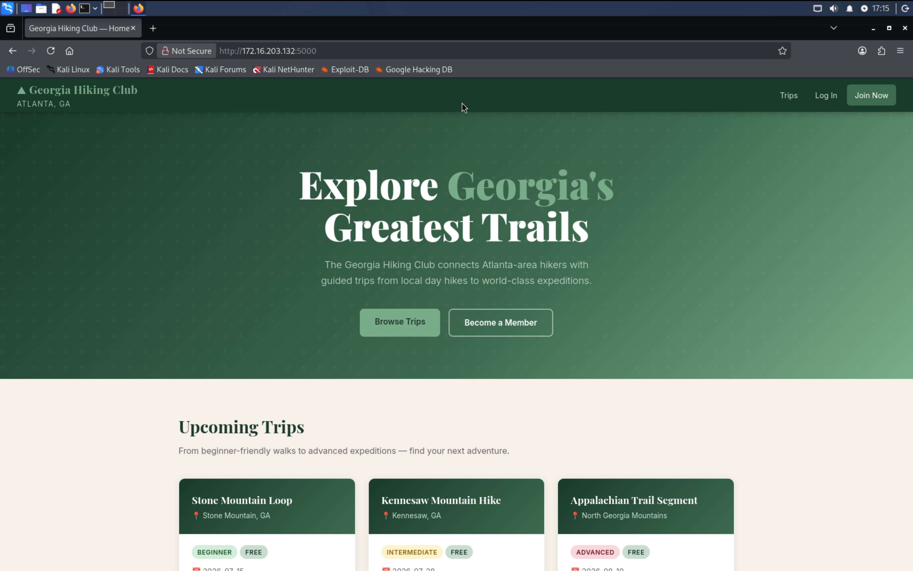
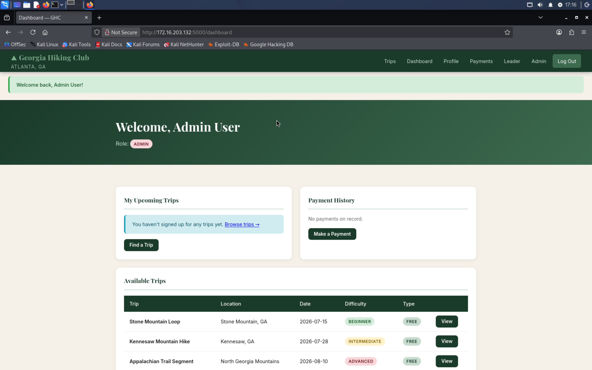
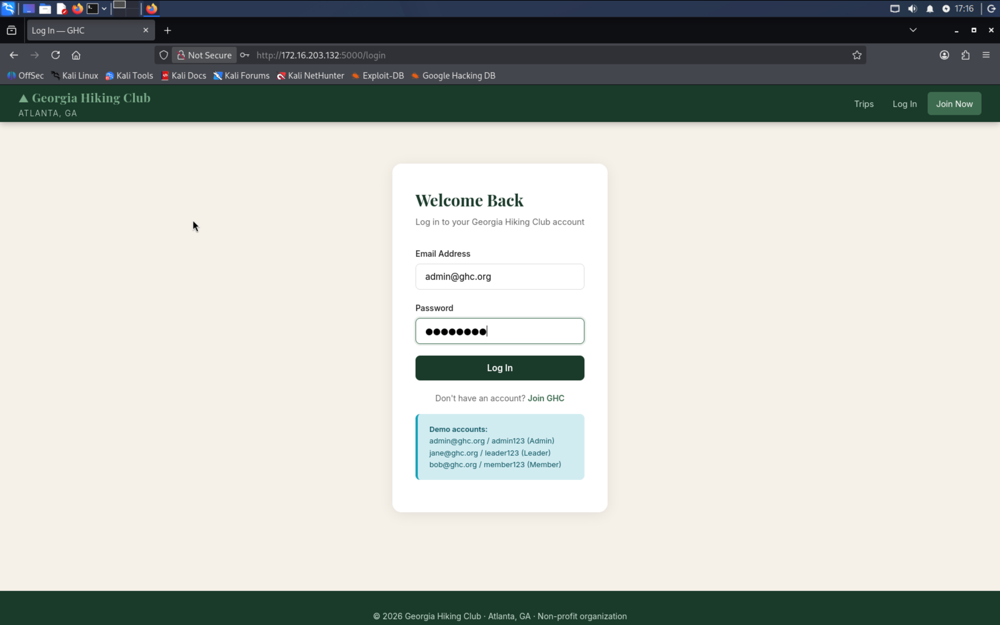
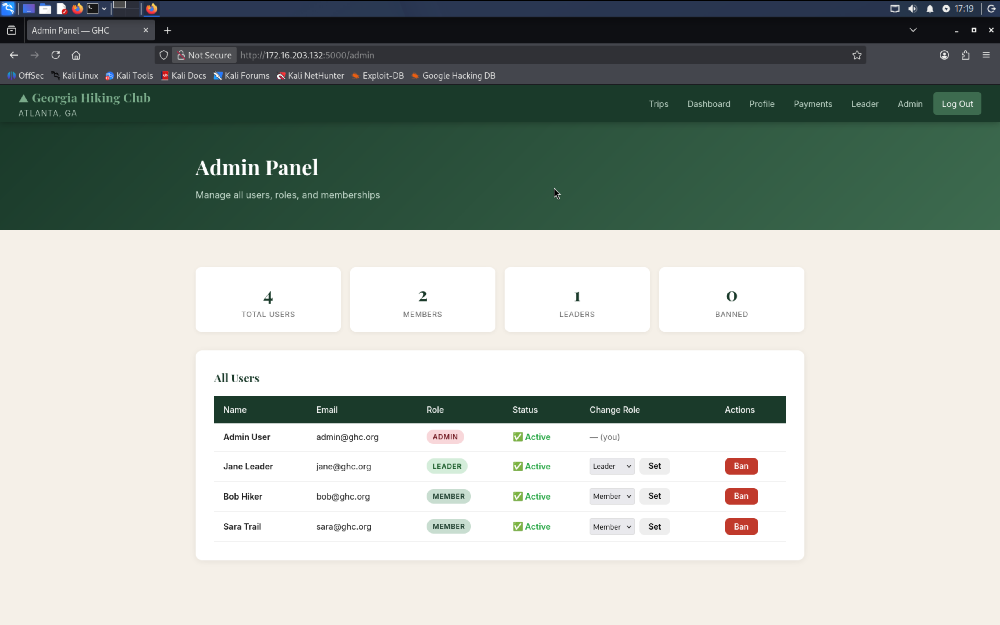
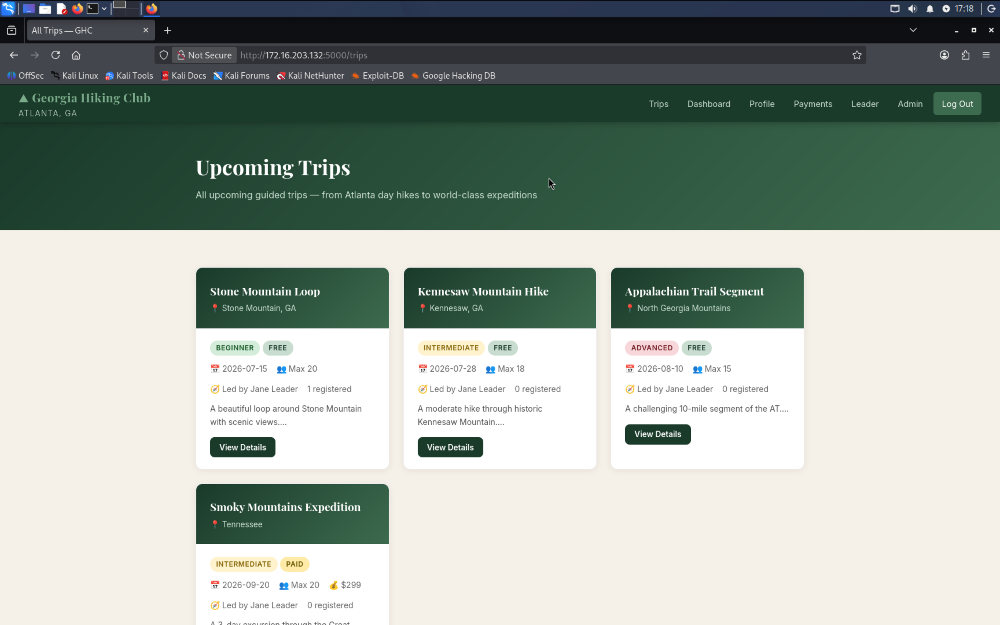
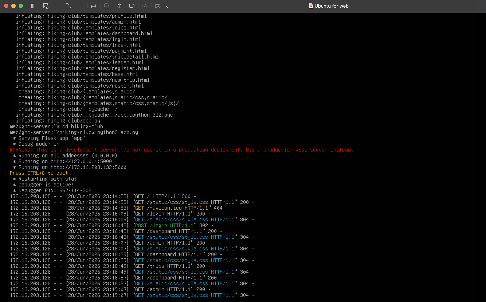
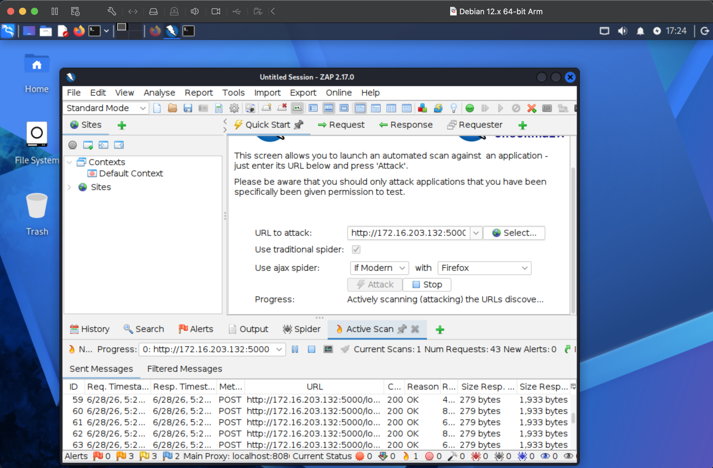
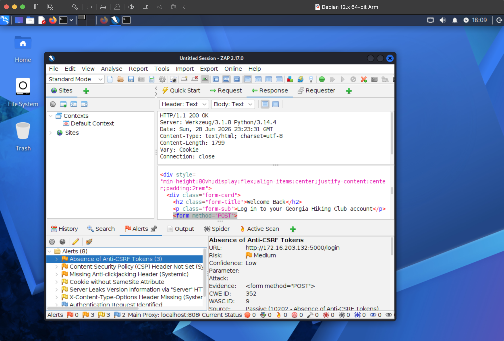

# Project 4 - Penetration Testing, Part 2

## Part 1: Website Penetration Testing Procedure

### Summary Table

| PHASE | DESCRIPTION | TOOLS |
| --- | --- | --- |
| Website Penetration Testing: Information Gathering (Ch 14) | In this phase, the penetration tester collects as much information as possible about the Hiking Club web application before attempting any attacks. This includes identifying the web server technology, frameworks, directories, hidden pages, and user input fields. For the Hiking Club, this is especially important given that it stores sensitive member data including medical conditions, payment information, and fitness notes. The goal is to map out the attack surface before any active testing begins. | DirBuster |
| Website Penetration Testing: Gaining Access (Ch 15) | In this phase, the penetration tester attempts to exploit vulnerabilities discovered during the information gathering phase. For the Hiking Club, this includes testing for SQL injection on the login and payment portal, cross-site scripting (XSS) on member profile fields, and brute force attacks on the authentication page (which the club has already been compromised by once). The goal is to simulate what a real attacker would do to gain unauthorized access to sensitive member data. | OWASP ZAP |

---

### Tool Description and Analysis

#### DirBuster
**Vendor Website:** https://www.kali.org/tools/dirbuster/

DirBuster is a multi-threaded Java application designed to brute force directories and file names on web servers. It works by sending HTTP requests to a target web server using a wordlist of common directory and file names, revealing hidden or unlinked pages that may not be publicly accessible. This makes it particularly useful for uncovering administrative panels, backup files, or configuration files left exposed on the server.

DirBuster is included in the default installation of Kali Linux 2019 and can be launched directly from the application menu.

For the Hiking Club application, DirBuster would be used to map out all directories and files on the web server, including any hidden admin panels used by administrators to manage members, trips, and payments. Since the Hiking Club stores sensitive data such as medical conditions and payment history, discovering unprotected or misconfigured directories could reveal serious vulnerabilities. For example, an exposed `/admin` or `/payments` directory could allow an attacker to access or modify member data without authentication.

---

#### OWASP ZAP
**Vendor Website:** https://www.zaproxy.org/

OWASP ZAP (Zed Attack Proxy) is a free, open-source web application security scanner maintained by the Open Web Application Security Project (OWASP). It acts as a proxy between the browser and the web application, intercepting and analyzing all traffic to identify security vulnerabilities such as SQL injection, cross-site scripting (XSS), and broken authentication. ZAP includes both automated scanning and manual testing tools, making it suitable for both beginners and experienced penetration testers.

OWASP ZAP is included in the default installation of Kali Linux 2019.

For the Hiking Club application, OWASP ZAP would be used to perform both automated and manual penetration testing on the authentication page, member profile forms, and payment portal. Given that the club was previously compromised via a brute force attack on the login page, ZAP's authentication testing features would be particularly valuable. Additionally, ZAP's active scanner would test all input fields, such as member registration forms and trip leader notes, for SQL injection and XSS vulnerabilities that could expose confidential medical information or payment data stored in the system.

---

## Part 2: Coding the Hiking Club Web Application

### Overview
The Georgia Hiking Club web application was built using **Python Flask** as the backend framework, **SQLite** as the database, and **HTML/CSS/JavaScript** for the frontend. This stack was chosen because Flask is lightweight, easy to deploy on a Linux VM, and simple to pen test with OWASP ZAP. This project was completed with the assistance of Claude AI (Anthropic), which was used as an agentic coding tool to generate the full application code, including all routes, templates, and database schema.

### Features Implemented
- Member registration and login with role-based access control (Member, Leader, Admin)
- Trip browsing, sign-up, and cancellation with capacity tracking
- Member dashboard showing registered trips and payment history
- Confidential member profiles with medical conditions and fitness notes visible only to leaders
- Trip leader panel with participant roster and outcome tracking (Finish/Did Not Finish/No Show)
- Admin panel for banning users and changing roles
- Payment portal for membership dues and excursion fees

### Application Structure

hiking-club/

├── app.py              # Main Flask application

├── requirements.txt    # Python dependencies

├── hiking_club.db      # SQLite database (auto-generated)

├── static/

│   └── css/

│       └── style.css   # Stylesheet

└── templates/          # HTML templates

├── base.html

├── index.html

├── login.html

├── register.html

├── dashboard.html

├── trips.html

├── trip_detail.html

├── profile.html

├── payment.html

├── leader.html

├── roster.html

├── new_trip.html

└── admin.html

### Issues Encountered
- **Agentic tool used:** This project was completed with the assistance of Claude AI (Anthropic), which was used as an agentic coding tool to generate the full application code, including all routes, templates, and database schema. Claude also provided step-by-step guidance throughout the entire lab setup, deployment, and pen testing process.
- **ARM64 compatibility:** Since the lab runs on Apple Silicon (M1 Pro), all VMs use ARM64 architecture which required careful selection of compatible packages.
- **File transfer:** The app was zipped and transferred to the deployment VM using `scp` from the Mac host to the Ubuntu Server VM. The initial transfer failed because the VM cannot locate the exact directory of the zip file. I need to find a way to transfer it to the virtual machine using the Mac terminal.

### Screenshots







## Part 3: Deployment on Ubuntu Server VM

### Deployment Environment
The Hiking Club web application was deployed on a dedicated **Ubuntu Server 26.04 LTS ARM64** virtual machine running inside VMware Fusion on the Mac M1 Pro host. This VM serves as the web server in the penetration testing lab environment.

**Deployment VM Details:**
- OS: Ubuntu Server 26.04 LTS ARM64
- IP Address: 172.16.203.132
- Port: 5000
- Framework: Python Flask (development server)

### Deployment Steps
1. Created a new Ubuntu Server VM in VMware Fusion with 20GB disk and 2GB RAM
2. Installed Python3 and pip: `sudo apt install python3 python3-pip -y`
3. Installed Flask: `pip3 install flask --break-system-packages`
4. Transferred the app from Mac to VM using `scp`:
```bash
   scp ~/Downloads/hiking-club.zip web@172.16.203.132:~
```
5. Unzipped the app: `unzip hiking-club.zip`
6. Started the application: `python3 app.py`
7. Verified the app was accessible from the Kali VM browser at `http://172.16.203.132:5000`

### Problems Encountered
- **File transfer path:** The `scp` command initially failed because the VM could not locate the exact directory of the zip file. Through the assistance of Claude, I found a way to transfer it to the virtual machine using the Mac terminal.

### Screenshot


---

## Part 4: Pen Testing with OWASP ZAP

### Setup
OWASP ZAP 2.17.0 was installed on the Kali Linux VM and used to perform an automated scan against the Hiking Club web application running at `http://172.16.203.132:5000`.

### Scan Results
ZAP identified **8 alerts** across the application:

| Alert | Risk | Description |
| --- | --- | --- |
| Absence of Anti-CSRF Tokens | Medium | Forms do not include CSRF tokens, making them vulnerable to Cross-Site Request Forgery attacks where an attacker tricks a logged-in user into submitting malicious requests. Found on the login page and other forms. |
| Content Security Policy (CSP) Header Not Set | Medium | The application does not set a CSP header, meaning the browser has no instructions on which content sources are trusted. This increases the risk of XSS attacks. |
| Missing Anti-clickjacking Header | Medium | The application does not set an X-Frame-Options or CSP frame-ancestors header, making it vulnerable to clickjacking attacks where the site is embedded in a hidden iframe. |
| Cookie without SameSite Attribute | Low | Session cookies do not have the SameSite attribute set, which could allow cross-site request attacks using the session cookie. |
| Server Leaks Version Information | Low | The server response header reveals the software version (Werkzeug/3.1.8 Python/3.14.4), giving attackers information about potential known vulnerabilities in those versions. |
| X-Content-Type-Options Header Missing | Low | The application does not set the X-Content-Type-Options header, which could allow MIME-type sniffing attacks in older browsers. |
| Authentication Request Identified | Informational | ZAP identified the login form as an authentication endpoint, flagging it for potential brute force testing. This is consistent with the Hiking Club's known history of being compromised via brute force. |

### Analysis
The most critical finding for the Hiking Club is the **Absence of Anti-CSRF Tokens** on forms, including the login page, payment portal, and member profile update forms. Given that the application stores sensitive medical information and handles payments, a CSRF attack could allow an attacker to submit unauthorized payments or modify members' medical records without the user's knowledge.

### Screenshots




---

## References
- Singh, Glen (2019). *Learn Kali Linux 2019*. Birmingham, UK, Packt.
- OWASP ZAP. https://www.zaproxy.org/
- DirBuster. https://www.kali.org/tools/dirbuster/
- Varonis. "Port Scanning Techniques." https://www.varonis.com/blog/port-scanning-techniques
- Claude AI (Anthropic). Used as an agentic coding assistant to develop the Hiking Club web application and provide lab setup guidance. https://www.anthropic.com
